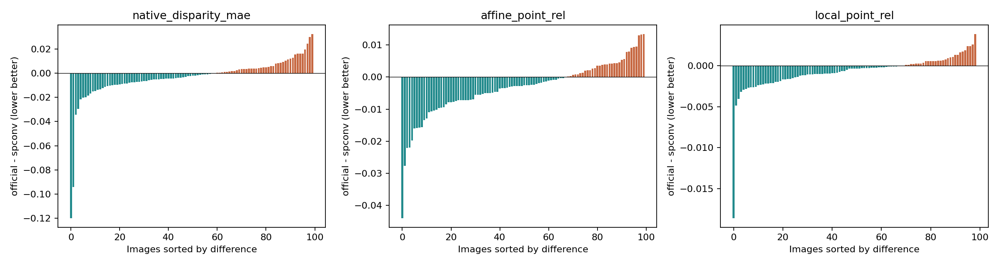
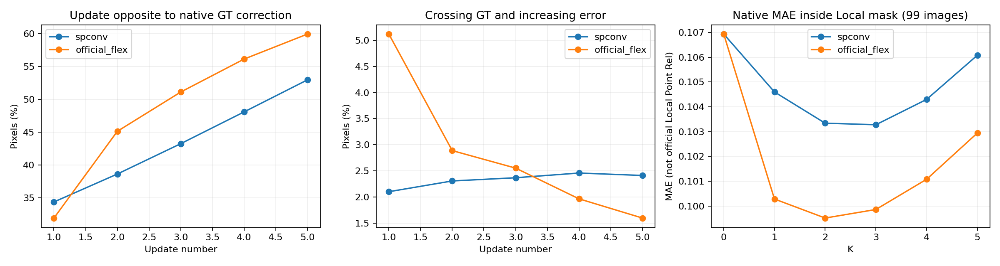

# Exp6-4 结果诊断

日期：2026-09-14。状态：CPU 配对分析、两组 Val100 补充推理和诊断图均已完成；未进行新训练。原正式结果、checkpoint 和网站资产保持不变。

## 结论

official_flex 的平均全局和 Local Point Rel 更好，但不是逐图、逐区域都更好。当前最值得优先验证的是更新方向与迭代监督，而不是直接换深度表达、缩小残差上限或延长训练。

计划中的三个问题得到以下回答：

1. 两组存在共同失效，但不能归结为同一种失败：原生 disparity 上有 15 张共同退化，official_flex 另有 14 张独有退化；Local Point Rel 上有 8 张共同退化。具体失败像素仍需结合代表图判断，图像级交集不代表逐像素失效位置完全相同。
2. 后续迭代确实会破坏部分已有改善。official_flex 的平均 K0→K3 收益约 88.8% 来自第一轮；26 张先在 K1 改善、随后 K3 比 K1 变差。其最终退化的 29 张中，7 张属于先改善再退化，另外 22 张在 K1 就没有改善，因此只减少迭代次数不能解决所有失败。
3. 大部分 full MAE 收益来自 Local 补集，但 Local 区域也有改善。Local 仅占有效像素约 8.85%，不能据此声称模型“只优化平面、不优化细节”。边界 F1 的两组差异较小，更不能把平均点误差优势等同于明显的边缘视觉优势。

## 1. 数据与评测口径

| 项目 | 本次使用 |
| --- | --- |
| 模型 | spconv、official_flex 各自固定 step 20,000 的 `last.pt` |
| Base | 同一官方 InfiniDepth Base，全程冻结；两组 checkpoint 的 Base 哈希一致 |
| 数据 | 固定 Hypersim Val100，共 46 个 scene；正式 Local 有效 99 张 |
| 主比较 | 固定终点 K3，对照共同 K0；K1、K5 用于迭代诊断 |
| 原正式指标 | 复用原逐图评测结果，不由补充推理覆盖 |
| 补充推理 | 两组各 100 张，eval/no_grad，一次获取 K0 至 K5；无 optimizer step |
| 图像宏平均 | 每图等权；空 Local 的 MAE 不记为 0 |
| 逐图平局 | 绝对差不超过 \(10^{-6}\)，仅为数值分组规则，不代表实际效果阈值 |

输入 ID、RGB/depth/tensor 哈希、分辨率、有效像素数和 Local 资产一致；两组 K0 对齐；从逐图结果重算的原指标与原 summary 一致。全部原正式预测的无效率为 0。

网站 VAL 5 张与本次 Val100 没有交集；网站固定 ROI 也不是正式 Local segmentation。网站用于跨实验定性比较，本报告不把网站样本或 test 用于方法选择。

正式 Global/Affine Point Rel 与 Local Point Rel 分别沿用原对齐和 segment 权重。下文像素图、区域 MAE、更新方向均基于原生归一化 disparity，不等同于上述几何指标。

## 2. 为什么看起来两种方法时好时坏

原正式 K3 配对结果如下。差值均为 official_flex 减去 spconv；除 F1 外越小越好。

| 指标 | spconv 均值 | official_flex 均值 | 差值中位数 | official 胜/平/负 |
| --- | ---: | ---: | ---: | ---: |
| Native disparity MAE | 0.058131 | 0.054461 | -0.002236 | 60 / 0 / 40 |
| Affine Point Rel | 0.077640 | 0.074237 | -0.002651 | 68 / 0 / 32 |
| Local Point Rel | 0.026788 | 0.026040 | -0.000353 | 69 / 0 / 30 |
| Boundary F1 radius 1 | 0.366849 | 0.367941 | -0.000105 | 48 / 1 / 51 |

official_flex 的 Native MAE 配对均值降低 6.31%，Local Point Rel 降低 2.79%；这并不意味着任意一张图都容易看出优势。Native 差值的 10%/90% 分位为 -0.014804 / +0.011363，存在明显的双向变化。

按 scene 内图像平均后，official_flex 在 Native MAE 上赢 31/46 个 scene，在 Local Point Rel 上赢 30/46 个。Native 优势不是仅由一个场景产生；但样本并非相互独立，统计推断仍沿用原 [scene bootstrap 报告](../results_20260914/paired_report.json)，本次不重采样寻找显著性。

最大的 5 张正收益样本占 official 相对 spconv 的 Native 正收益总和约 43.5%，Local 正收益总和约 32.6%。这里分母是所有正收益之和，不是净收益。中位数仍支持 official，说明收益并非完全由少数样本决定。

相对共同 K0 的分组：

| 指标 | 两组改善 | 仅 spconv 改善 | 仅 official 改善 | 两组退化 |
| --- | ---: | ---: | ---: | ---: |
| Native MAE，100 张 | 66 | 14 | 5 | 15 |
| Local Point Rel，99 张 | 83 | 4 | 4 | 8 |

Native MAE 中 spconv 有 20 张退化，official 有 29 张退化。official 的均值更低、改善张数反而更少，说明其收益幅度与失败风险更不均匀。最差 5 张及完整分布见 [summary.json](./summary.json)，所有原始数值见 [per_image.csv](./per_image.csv)。



## 3. 多轮迭代是否破坏已有改善

以下仍为原正式评测均值，不混入补充推理数据。

| 方法 | Native K0 | K1 | K3 | K5 |
| --- | ---: | ---: | ---: | ---: |
| spconv | 0.063314 | 0.060598 | 0.058131 | 0.059564 |
| official_flex | 0.063314 | 0.055457 | 0.054461 | 0.055964 |

| 逐图变化 | spconv | official_flex |
| --- | ---: | ---: |
| Native：K1 优于 K0，但 K3 差于 K1 | 19/100 | 26/100 |
| Native：K1 优于 K0，但 K3 差于 K0 | 9/100 | 7/100 |
| Native：K5 差于 K3 | 68/100 | 78/100 |
| Local Point Rel：K5 差于 K3 | 72/99 | 86/99 |

两组都存在迭代退化，official 的主要平均收益集中在第一轮。K5 超出训练直接监督的 K0–K3 范围，其退化属于迭代外推的稳定性问题，不能单凭这一点认定训练实现错误。

每图最优 K 分布已保存在 `summary.json`，只作事后诊断；本报告未按图选择最优 K，也未改用补充推理中偶然更低的 K2 替代预定主指标 K3。

训练 full evaluation 最后 5,000 steps：spconv K3 MAE 从 0.058840 降至 0.058131，约改善 1.20%；official 从 0.054615 降至 0.054461，约改善 0.28%。两组仍有下降，但目前证据不足以认定“只要再训久一点就能解决失效”，也不能断言已经完全收敛。


## 4. 是残差太大，还是更新方向不对

对原生 disparity 定义所需修正与实际更新：

\[
e^k=d_{GT}-d^k,\qquad u^k=d^{k+1}-d^k.
\]

方向相反为 \(e^ku^k<0\)；有害跨越为跨过 GT 且绝对误差增加。跨过 GT 但更接近 GT 不算有害。

第三轮更新，即 K2→K3；下表为先逐图统计有效像素比例、再对 100 张取均值。

| 统计 | spconv | official_flex |
| --- | ---: | ---: |
| 与 GT 修正方向相反的像素 | 43.24% | 51.12% |
| 跨过 GT 且误差增加的像素 | 2.37% | 2.55% |
| 绝对误差增加的像素 | 45.60% | 53.66% |
| 平均绝对更新量 | 0.006136 | 0.005189 |
| 接近单步限幅，\(\lvert u\rvert\geq0.095\) | 0.00% | 0.49% |

official_flex 第三轮的平均更新量比 spconv 更小，但方向相反的像素更多。其第一轮、第三轮、第五轮的反向比例约为 31.88%、51.12%、59.97%；有害跨越比例反而下降。这不支持把主要失效简单解释为“沿正确方向走太远”。

official 最终改善的 71 张，第三轮反向比例平均为 45.88%；最终退化的 29 张为 63.94%。反之，有害跨越比例分别为 3.00% 和 1.46%，并未在退化组更高。这是诊断关联，不是独立因果证明；像素比例也不等同于误差贡献大小。

数值健康情况：

- 补充推理全部完成，无 NaN/Inf、OOM 或 bounded residual 越界。official 存在少量限幅饱和，但不等于发生残差爆炸。
- 原训练日志每组有 40 个记录点，记录的 loss、梯度范数和 residual 均有限；不能把这 40 个点冒充逐 step 全量审计。
- raw residual 不受 0.1 边界直接约束。例如 spconv 训练日志中 raw 最小值达到约 -2.25，经有界映射后仍在单步约 0.1 内。不得混淆 raw、bounded 与多轮累积更新。
- voxel span 是内部体素坐标跨度，不是原生 disparity 数值。本次随迭代未发现发散趋势；完整范围见 [audit.json](./audit.json)。

“方向相反”仅针对逐像素 MAE 修正方向，不是 optimizer 梯度方向。训练还包含梯度损失，正式几何指标也有对齐，不能要求每个像素每一步都严格减小原生 MAE。

按计划跳过可选 \(\alpha=0.5\) 推理：当前没有足够证据把过量跨越作为主机制。跳过不等于证明减半无效，只是不据此增加无针对性的试验。



## 5. 收益来自哪些区域

复用正式 Local segmentation 的非零并集；补集仅表示有效域内不在 Local mask 中的像素，不等于平面。

对区域 \(R\) 定义其对 full MAE 改善的贡献：

\[
C_R=\frac{1}{|V|}\sum_{p\in R}
\left(|d^0_p-d_{GT,p}|-|d^3_p-d_{GT,p}|\right).
\]

每图验证 \(C_L+C_{V\setminus L}=C_V\)。贡献与面积均对 100 张平均，空 Local 贡献为 0；区域内 MAE 仅对 99 张非空 Local 平均。这两种分母不能混用。

| 区域诊断 | spconv | official_flex |
| --- | ---: | ---: |
| Local 平均面积占比 | 8.85% | 8.85% |
| Local 区域 Native MAE，K0 | 0.106936 | 0.106936 |
| Local 区域 Native MAE，K3 | 0.103278 | 0.099861 |
| Local 对 full MAE 的改善贡献 | 0.000507 | 0.000697 |
| Local 补集对 full MAE 的改善贡献 | 0.004676 | 0.008156 |
| Local 占总改善的比例 | 9.79% | 7.88% |

Local 区域确有改善，贡献比例与其面积在同一量级；不能仅凭补集占 90% 以上收益就断言细节没有改善。正式 Local Point Rel 的结论应读取第 2 节，不能与上表区域 native MAE 互换。

按每图有效 GT radial depth 的三等分分位划分近/中/远区域，两组使用同一边界，每组约占三分之一像素。它们是每图相对远近，不是固定米数区间。

| 区域 Native MAE | 共同 K0 | spconv K3 | official K3 |
| --- | ---: | ---: | ---: |
| 近 | 0.080867 | 0.072040 | 0.065875 |
| 中 | 0.065431 | 0.060810 | 0.057050 |
| 远 | 0.043571 | 0.041480 | 0.040416 |

两组三个区域的 K3 均值都优于 K0，未观察到“共同远处整体失败”。official 的近/中/远贡献占比约为 56.6% / 31.6% / 11.8%。原生 disparity 对不同距离的刻画与几何误差并不等价，不能凭贡献不均匀就确定表达有问题。

逐图 disparity 2%–98% 跨度与 K3 收益的 Pearson 相关约为 spconv -0.20、official -0.18，关联较弱且有场景混杂。目前不足以把 disparity 表达确定为根因。

## 6. 代表图

[打开本地诊断图册](./gallery.html)。共 12 张代表图和 3 张汇总图，不需要启动网站或重新下载 PLY。

12 张图在补充推理前按 Local Point Rel 固定规则选定：official 优势、spconv 优势、接近、两组退化各 3 张；优先不同 scene，并去重。完整选择依据见 [selection.json](./selection.json)。这些图用于解释失效，不用于估计总体胜率。

每张包含 RGB、GT、共同 K0、两组 K1/K3/K5、误差图、相对 K0 收益和 Local mask 轮廓。两方法同图同色标；蓝色表示误差减少，红色表示增加。误差 p98、差值绝对值 p99 截断仅用于显示，数值指标不裁剪。

两个可直接查看的例子：

- [ai_015_004_cam_00_frame.0088](./figures/ai_015_004_cam_00_frame.0088.png)：official Local 优势样本；Local mask 只覆盖画面一小部分，整幅场景观感不必与 Local 指标差异成比例。
- [ai_005_005_cam_00_frame.0092](./figures/ai_005_005_cam_00_frame.0092.png)：两组 Local 均退化；原生误差图还显示较大区域的偏移，不宜只盯局部边缘找原因。

边界分析复用原 Boundary F1 radius 1，没有另造边界提取算法，也未新增边界带区域指标。

## 7. 只推荐一项下一步实验

优先方向：在 official_flex、原生 disparity 和冻结 Base 均不变的前提下，检验“对单张图的迭代退化显式约束，是否能减少失败而保留平均收益”。

当前各 K 损失取平均，并不保证每张图逐轮改善。建议下一份训练计划只增加一个训练期的迭代非退化辅助项，覆盖 K0→K1、K1→K2、K2→K3，而不只是惩罚后两轮。例如：

\[
E_i^k=\operatorname{MAE}_{valid}(d_i^k,d_{GT,i}),\qquad
L_{stable}=\frac{1}{3}\sum_{k=0}^{2}
\max\left(0,E_i^{k+1}-\operatorname{stopgrad}(E_i^k)\right),
\]

\[
L_{new}=L_{current}+\lambda L_{stable}.
\]

`stopgrad` 避免通过直接增大前一步参考误差来减轻惩罚。这只是待验证假设，不保证学到正确更新，也不能把“输出接近恒等映射、因此不再退化”当作成功。

下一步需固定：网络、disparity 表达、Base 冻结、数据划分与采样顺序、seed 173、20,000-step 预算、学习率、batch、原梯度损失和主评估 K3。辅助项只在 train 上计算，\(\lambda\) 在启动前固定，不扫描 Val100 逐图挑参数；复用本次 official 原损失结果作对照，不重复无改动的第二 seed。

判断应同时看 Native MAE、相对 K0 的退化数、配对差值，以及 Affine/Local Point Rel 和 Boundary F1。若只降低退化数，却损失平均改善或局部质量，不能认为假设成立。K5 仍是次要稳定性诊断，不作为事后更换主指标的理由。

反例与限制：22 张 official 最终失败图在 K1 已无改善，说明问题不限于晚期累积；逐像素方向诊断与训练中的梯度目标并不完全一致。该实验只能检验一种监督方式，不能证明网络、表达或训练长度都没有问题。本轮尚未实现此损失或启动该训练。

## 8. 执行、数值差异与复现

实现复用现有模型、缓存、评测加载器和 residual 监控；CPU 汇总仅用标准库，推理/绘图用已有 PyTorch、NumPy、Matplotlib，未新增依赖。S115 GPU 3 上两组顺序执行，允许共享，不控制其他用户任务。

初次 smoke 的 refined MAE 对原评估容差为 \(10^{-5}\)，official 的 K5 超出该门槛。恢复原实验的 FlexGEMM autotune 缓存后仍有小差异；两张图、同进程三次重复前向显示 K0 完全相同，稀疏迭代输出并非逐位相同，差异伴随重新体素化逐轮扩大。不能把缓存误配说成已经确认的唯一根因，也未定位到某个确定 kernel。

保留 r1/r2 记录，r3 显式采用 K0 MAE 容差 \(10^{-6}\)、refined MAE 容差 \(10^{-4}\)。新推理仅用于像素诊断，所有正式优劣数值仍来自原评测。完整 100 张复核的最大绝对差为：

| 与原评测的 Native MAE 最大差 | spconv | official_flex |
| --- | ---: | ---: |
| K0 | 2.48e-8 | 2.48e-8 |
| K3 | 2.20e-6 | 1.16e-5 |
| K5 | 1.53e-5 | 4.10e-5 |

差异小于平均方法差距，但不应过度解释接近数值精度的逐图名次。原始重复前向结果见 [repeated_forward_probe.json](./inputs/repeated_forward_probe.json)，处理过程见 [incident.jsonl](./incident.jsonl)。

每组 100 张前向与像素统计累计计时约 spconv 31.16 秒、official 24.37 秒；CUDA allocator 记录的峰值分别约 3.07 / 2.90 GiB。这不包含模型加载、缓存读取、NPZ 保存、绘图和传输，不是端到端耗时或正式吞吐基准。

验证完成：标准库自测、服务器 NumPy 像素自测、两组 smoke、200 张完整推理、原汇总重算、输入/checkpoint/选图哈希核验、逐图及宏平均贡献可加性、有限值/限幅核验和代表图目视检查。[audit.json](./audit.json) 记录审计结果，[artifact_manifest.json](./artifact_manifest.json) 记录产物字节数与 SHA-256。

源码按执行阶段保留：[推理快照](./analyze_results.py)、[绘图快照](./render_analysis.py)、[最终汇总与审计快照](./audit_analysis.py)。推理快照哈希与各组 provenance 匹配；后续仅增加报告、绘图和审计，没有改变已执行前向。具体路径、命令和简化边界见 [execution.json](./execution.json)。

复算 CPU 汇总与审计，在本仓库根目录执行：

```bash
python3 experiment/exp6_4_official_ssr_disparity_adapter/analyze_results.py self-test
python3 experiment/exp6_4_official_ssr_disparity_adapter/analyze_results.py summary --config experiment/exp6_4_official_ssr_disparity_adapter/config.json --output experiment/exp6_4_official_ssr_disparity_adapter/analysis_20260914_r3
python3 experiment/exp6_4_official_ssr_disparity_adapter/analyze_results.py audit --output experiment/exp6_4_official_ssr_disparity_adapter/analysis_20260914_r3
```

本次只分析一个 seed、一个数据集的现有 checkpoint；后续依据 Val100 作出的设计仍需独立留出评估验证，test 本轮未使用。
